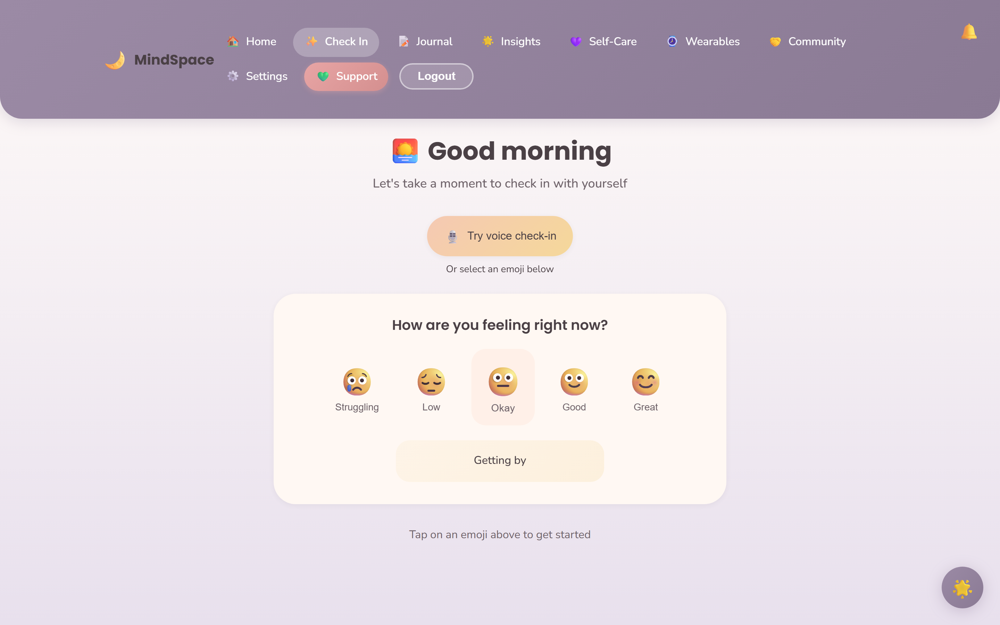
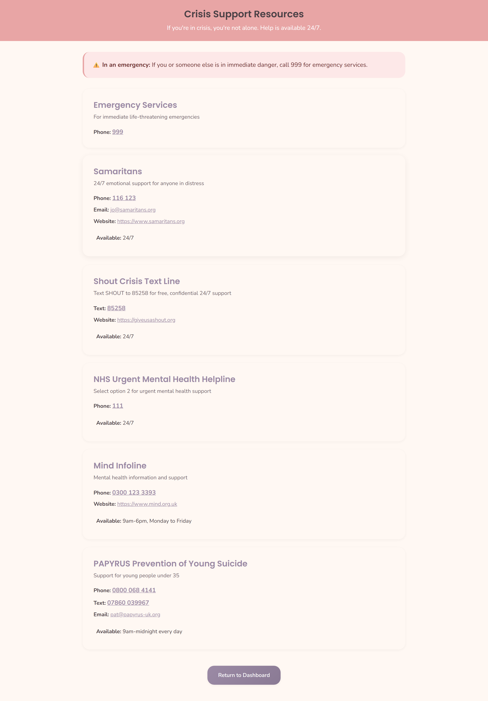

# Mindspace — Privacy-First Mental Health Tracker

[](https://github.com/mlily2024/Mindspace/actions/workflows/ci.yml)
[](https://opensource.org/licenses/MIT)
[](https://github.com/mlily2024/Mindspace/releases)
[](https://mindspace-demo.onrender.com)

A full-stack mental-health platform built privacy-first by construction: not "we encrypt the data", but a composition of three independent privacy mechanisms that together make user content cryptographically unreadable to the server, statistically unidentifiable in aggregate, and structurally inaccessible to third-party services.

Version 2.1.1 · MIT licensed · UK GDPR & Data Protection Act 2018 compliant · WCAG 2.1 AA accessible

---

## Why this exists

Most mood-tracking apps treat privacy as a checkbox: "we encrypt notes at rest." The user's plaintext still touches the server, the operator can still derive cohort statistics that re-identify individuals, and sentiment-analysis features ship the entire journal entry to a third-party API.

Mindspace was built to demonstrate that a serious privacy posture is **achievable for solo developers using off-the-shelf tooling**, with no special infrastructure. Every mechanism is grounded in a public cryptographic or statistical standard, and the full system runs from a `docker compose up`.

---

## Architecture — three composable privacy mechanisms

Each mechanism is implemented in code referenced below and validated by tests on every push. They compose: they protect different attack surfaces, can be enabled independently, and do not weaken each other.

### 1. Hash-chained AI audit log

Every Luna chatbot interaction (rule-based, LLM-backed, or crisis-filter response) appends a privacy-preserving record to a **per-user hash chain**. SHA-256 fingerprints are stored, not plaintext. The DB layer enforces append-only at trigger level; `verifyChain(userId)` walks the chain end-to-end and returns the offending sequence number if any link is tampered with.

| Property | How it is enforced |
|---|---|
| Append-only | PostgreSQL `BEFORE UPDATE` trigger blocks writes to existing rows |
| Concurrent-safe | Per-user `pg_advisory_xact_lock` serialises chain appends |
| Tamper-evident | Each row hashes the prior row's `record_hash` + canonical-form fields |
| No plaintext | Conversation content stored as SHA-256 only |

**Cryptographic basis:** Haber & Stornetta, "How to time-stamp a digital document" (1991).
**Code:** `backend/src/services/aiAuditService.js` · `backend/database/migrations/009_ai_audit_log.sql`

### 2. ε-differentially private cohort aggregates

Cross-user statistics (e.g. average mood by day-of-week) are released through a **Laplace mechanism** with cryptographic randomness (`crypto.randomBytes`, not `Math.random`). A `PrivacyBudget` class tracks sequential composition per scope and refuses any query that would exceed the configured ε ceiling. Outputs are post-clamped to the bounded mood range `[1, 10]`; small-cell suppression hides under-populated buckets.

| Property | How it is enforced |
|---|---|
| Mathematically-bounded leakage | Laplace noise scaled to query sensitivity |
| Budget enforcement | `PrivacyBudget` denies queries exceeding scope ε |
| Cryptographic randomness | `crypto.randomBytes` for noise draws |
| Composition awareness | Parallel composition over partitioned queries |

**Theoretical basis:** Dwork & Roth, *The Algorithmic Foundations of Differential Privacy* (2014); Dwork, McSherry, Nissim, Smith, "Calibrating noise to sensitivity in private data analysis" (2006).
**First protected endpoint:** `GET /api/cohort-insights/mood-by-day-of-week`
**Code:** `backend/src/services/differentialPrivacy.js` · `backend/src/services/cohortInsightsService.js`

### 3. On-device sentiment analysis

Sentiment classification of journal text runs **entirely in the user's browser** via Transformers.js (DistilBERT int8 quantised, ~67 MB cached after first load, 10-80 ms inference on modern hardware). The server only receives derived fields: `sentimentScore` ∈ [-1, 1], label, confidence, model id, character count, a SHA-256 of the text, inference time, and the linked mood-entry id. **Plaintext never leaves the device.**

Opt-in via Settings → Privacy & Data. Disabled by default. Graceful fallback if the model fails to load: feature stays off, mood-save flow remains 100% functional.

| Property | How it is enforced |
|---|---|
| Plaintext locality | Inference runs in the WebAssembly runtime of the browser |
| No model exfiltration | Model weights served from a static CDN, not user-bound |
| Verifiable transport | Server-side schema rejects requests carrying note text |
| Opt-in by design | Off by default; failure mode preserves base mood functionality |

**Model basis:** Sanh et al., "DistilBERT: a distilled version of BERT" (2019); Socher et al., SST-2 (2013).
**New endpoint:** `POST /api/mood-sentiments`
**Migration:** `backend/database/migrations/010_mood_sentiments.sql`
**Code:** `frontend/src/services/sentimentService.js`

---

## Engineering quality

| Signal | Status |
|---|---|
| Backend tests | **213 passing** across 15 suites — `cd backend && npm test` |
| Backend lint | 0 ESLint errors (with a deliberate, minimal ruleset) |
| Frontend lint | 0 ESLint errors |
| CI | `.github/workflows/ci.yml` — 2 parallel jobs (backend + frontend), runs on every push and PR, ~40 seconds total |
| Builds | Clean Vite build, coverage + dist artefacts uploaded per run |
| Migrations | 10 numbered SQL migrations, idempotent (`CREATE TABLE IF NOT EXISTS`) |
| Encryption | **AES-256-GCM** authenticated encryption only — no CryptoJS fallback (since commit `73f4655`); `decrypt()` throws on any non-AES-GCM input |
| Crisis content | UK-localised, frozen module, regression-guarded against US-number reintroduction |
| Releases | Annotated tags with embedded release notes; latest `v2.1.1` |

---

## Live demo

A complete, publicly-accessible deployment of the system is hosted on Render.

**URL:** `https://mindspace-demo.onrender.com`
**Credentials (public):** `demo@mindspace.local` / `DemoMindspace!2026`

> The demo runs on Render's free tier, which sleeps the backend after ~15 minutes of inactivity. The first request after a quiet period takes ~30 seconds while the container wakes. Subsequent requests are instant.

### What to explore

After logging in:

| Page | What you'll see |
|---|---|
| **Home (Dashboard)** | Wellbeing summary card (average mood, sleep, check-ins over the last 30 days), current streak widget, achievement progress, personalised self-care recommendations |
| **Check In** | The mood entry flow — emoji-driven 5-point mood selector with optional detail (energy, stress, sleep, anxiety, social interaction, free-text notes) |
| **Insights** | The strongest single visualisation of the system: 3-week mood trend, weekday-best-day analysis, peak-time-of-day correlation, factor-impact panel ("Sleep Quality strong positive correlation with mood"), adaptive suggestions panel, and a coloured month-calendar of mood scores |
| **Journal** | Free-text journal entries with optional on-device sentiment scoring (Settings → Privacy & Data → On-device sentiment to enable) |
| **Self-Care** | Activity library categorised by user-group context |
| **Settings → Privacy & Data** | The on-device sentiment toggle, data export, account deletion (right-to-be-forgotten), audit-log view |

### About the demo data

The demo account is seeded with three weeks of varied mood, sleep, and energy entries that demonstrate the insights engine producing real correlations from real data. The seeded arc deliberately includes a mid-period dip and recovery so the trend chart shows movement.

The demo database is durable — entries you add as the demo user persist across deployments. If you want to test the account-deletion flow, register a fresh account; the demo user is preserved.

---

## Screenshots

The screenshots below are captured automatically by `frontend/scripts/capture-screenshots.js` (Playwright) against a backend seeded by `node backend/scripts/seed-demo-data.js`. To refresh after a UI change: `cd frontend && npm run screenshots`.

### Dashboard


### Mood entry


### Insights and trends


### Luna therapeutic chatbot


### UK crisis resources


---

## Beyond privacy: the rest of the system

Mindspace is also a complete mental-health platform. The features below are built on top of the privacy foundation described above.

### Core tracking
- Multi-dimensional mood and wellbeing logging (mood, energy, stress, anxiety, sleep quality, sleep hours, social-interaction quality, activities, triggers)
- Encrypted private notes (AES-256-GCM authenticated encryption per record)
- Historical analysis with date-range filtering, trend visualisation, statistical summaries

### Intelligence layer
- AI-driven insights engine — automatic trend detection, pattern recognition, anomaly flagging, weekly and monthly summaries
- Predictive analytics — mood-trend prediction and early-warning detection
- Adaptive recommendations — personalised self-care activities that adjust to user feedback
- User segmentation and personalisation by life-stage group

### Luna therapeutic chatbot
- Conversational support grounded in **CBT and ACT** therapeutic techniques
- Pluggable response engine — defaults to the offline, zero-cost template engine; deployments can opt in to a Claude-backed LLM (per-user `llm_opted_in` toggle, GDPR-conscious) for richer responses. Crisis content is filtered **before** any LLM call, so safety never depends on a third-party service
- UK-localised crisis detection with direct escalation to UK helplines (Samaritans, Shout, NHS 111, Papyrus, 999)
- Every interaction recorded in the hash-chained audit log described above
- Emotional-granularity training to refine broad emotions into specific ones
- Longitudinal conversation memory

### Clinical and advanced features
- Clinical assessment instruments and clinician-facing reports
- Voice analysis — voice-signature and emotional-tone analysis (accepts pre-extracted features)
- Wearable integration — biometric correlation with mood data (pluggable provider model)
- Ecological Momentary Assessment (EMA) and quick check-ins
- Micro-interventions and structured therapeutic protocols
- Anonymous peer support with automated moderation
- Gamification — engagement and habit-building mechanics

### Safety and crisis support
- Real-time risk detection with severity tiers (low / moderate / high / critical)
- UK-specific crisis resources integrated and always accessible (see below)

### Notifications
- Real-time in-app notifications via Socket.io for online users (instant, no permission prompt)
- Browser push notifications via Web Push (VAPID) for users with the tab closed — opt-in only, per-browser. Stale endpoints auto-prune; per-subscription failures are isolated

### Security and accessibility
- bcrypt password hashing, JWT authentication, Helmet security headers (CSP + HSTS), rate limiting, input validation/sanitisation, parameterised queries
- UK GDPR and Data Protection Act 2018 compliance — data export, account deletion, audit logging, data-retention controls
- WCAG 2.1 Level AA — keyboard navigation, screen-reader support, adjustable font sizes, high-contrast mode, reduced-motion support, semantic HTML, ARIA labelling

---

## Technology stack

### Backend
- **Runtime:** Node.js 18+, Express 4
- **Database:** PostgreSQL 14+ (via `pg`)
- **Authentication:** JWT (`jsonwebtoken`) + bcryptjs
- **Encryption:** Node native `crypto` — AES-256-GCM only
- **Real-time:** Socket.io
- **Security:** Helmet, CORS, express-rate-limit, express-validator
- **Logging:** Winston

### Frontend
- **Framework:** React 18
- **Build tool:** Vite 5
- **Routing:** React Router 6
- **State management:** Zustand
- **HTTP:** Axios
- **Charts:** Recharts
- **Real-time:** Socket.io-client
- **ML:** Transformers.js (DistilBERT int8) for on-device sentiment

---

## Quick start

### Option A — Docker (recommended)

The fastest, most reproducible way to run the whole stack (PostgreSQL + backend + frontend) with one command.

**Prerequisites:** Docker and Docker Compose.

```bash
# 1. Clone the repository
git clone https://github.com/mlily2024/Mindspace.git
cd Mindspace

# 2. Create a .env file at the project root with at least:
#    DB_PASSWORD, JWT_SECRET, ENCRYPTION_KEY, ADMIN_PASSWORD
#    (generate secrets with: node -e "console.log(require('crypto').randomBytes(32).toString('hex'))")
cp .env.docker.example .env   # then edit .env

# 3. Build and start everything
docker compose up --build
```

Once running:
- **Frontend:** http://localhost:3000
- **Backend API:** http://localhost:5000
- **API health check:** http://localhost:5000/health

The PostgreSQL schema is initialised automatically on first run.

To stop: `docker compose down` (add `-v` to also remove the database volume).

### Option B — Manual local setup

**Prerequisites:** Node.js 18+, PostgreSQL 14+, Git.

```bash
# 1. Clone
git clone https://github.com/mlily2024/Mindspace.git
cd Mindspace

# 2. Set up the database
createdb mental_health_tracker
psql mental_health_tracker < database/schema.sql

# 3. Configure and run the backend
cd backend
npm install
cp .env.example .env          # then edit .env with your DB password + generated secrets
npm run dev                   # starts on http://localhost:5000

# 4. Configure and run the frontend (in a second terminal)
cd frontend
npm install
echo "VITE_API_BASE_URL=http://localhost:5000/api" > .env
npm run dev                   # starts on http://localhost:3000
```

---

## Environment variables

Generate strong secrets before running:

```bash
node -e "console.log(require('crypto').randomBytes(32).toString('hex'))"
```

| Variable | Purpose |
|---|---|
| `PORT` | Backend port (default 5000) |
| `NODE_ENV` | `development` or `production` |
| `DB_HOST` / `DB_PORT` / `DB_NAME` / `DB_USER` / `DB_PASSWORD` | PostgreSQL connection |
| `JWT_SECRET` | Token signing secret (≥64 chars recommended) |
| `JWT_EXPIRE` | Token lifetime (e.g. `4h`) |
| `ENCRYPTION_KEY` | AES-256-GCM key material (≥32 chars) |
| `ADMIN_PASSWORD` | Admin panel password (≥12 chars) |
| `RATE_LIMIT_WINDOW_MS` / `RATE_LIMIT_MAX_REQUESTS` | Rate-limiting configuration |
| `ALLOWED_ORIGINS` | Comma-separated CORS allow-list |

See `backend/.env.example` for the full template.

---

## API surface

The backend exposes a RESTful API under `/api`, including:

| Area | Base route |
|---|---|
| Authentication | `/api/auth` |
| Mood tracking | `/api/mood` |
| Mood sentiments (on-device-sourced) | `/api/mood-sentiments` |
| Cohort insights (ε-DP-protected) | `/api/cohort-insights` |
| Insights | `/api/insights` |
| Recommendations | `/api/recommendations` |
| Luna chatbot | `/api/chatbot`, `/api/luna` |
| Peer support | `/api/peer-support`, `/api/peer-support/enhanced` |
| Gamification | `/api/gamification` |
| Predictive intelligence | `/api/predictions`, `/api/predictions/v2` |
| Voice analysis | `/api/voice` |
| Interventions | `/api/interventions` |
| Wearables | `/api/wearables` |
| Quick check-in / EMA | `/api/quick-checkin`, `/api/ema` |
| Protocols | `/api/protocols` |
| Clinical assessments | `/api/assessments` |
| Clinician reports | `/api/clinician-reports` |
| Push notifications | `/api/push` |
| Admin | `/api/admin` |

---

## Project structure

```
Mindspace/
├── backend/
│   ├── src/
│   │   ├── config/        # database, logger, socket.io configuration
│   │   ├── controllers/   # request handlers
│   │   ├── middleware/    # auth, validation, error handling
│   │   ├── models/        # database models
│   │   ├── routes/        # API route definitions
│   │   ├── services/      # business logic (insights, Luna, audit log, DP, cache)
│   │   ├── handlers/      # socket.io event handlers
│   │   ├── utils/         # encryption and helpers
│   │   ├── data/          # therapeutic technique data
│   │   └── server.js      # application entry point
│   ├── database/          # backend-local schema copy
│   ├── scripts/           # operational scripts (migrations, seeders, push tests)
│   ├── Dockerfile
│   └── .env.example
├── frontend/
│   ├── src/               # React application
│   ├── services/          # client-side services (sentiment, API)
│   ├── Dockerfile
│   └── nginx.conf
├── database/
│   ├── schema.sql         # PostgreSQL schema (GDPR-compliant design)
│   └── migrations/        # numbered idempotent migrations 001-010
├── docs/                  # screenshots
├── .github/workflows/     # CI (ci.yml) + nightly demo refresh (render-demo-reset.yml)
├── docker-compose.yml
└── README.md
```

---

## User groups and personalisation

| Group | Focus |
|---|---|
| Students | Academic stress, exam anxiety, social pressure, sleep optimisation |
| Professionals | Burnout detection, work-life balance, chronic-stress management |
| Parents | Emotional overload, caregiving stress, self-care prompts |
| Elderly | Loneliness, grief support, routine maintenance, large-text simple interface |

---

## Crisis resources (UK)

Integrated and always accessible within the app:

- **Emergency services:** 999
- **Samaritans:** 116 123
- **Shout Crisis Text Line:** text SHOUT to 85258
- **NHS Urgent Mental Health:** 111
- **Mind Infoline:** 0300 123 3393
- **PAPYRUS (under-35s):** 0800 068 4141

---

## Optional features setup

Both LLM-backed Luna and browser push notifications are **off by default** and require a small one-time setup to enable.

### LLM-backed Luna (Anthropic Claude)
Generate or supply an Anthropic API key, then add to `backend/.env`:
```
LUNA_PROVIDER=anthropic
ANTHROPIC_API_KEY=sk-ant-...
```
Defaults (all env-overridable in `backend/.env.example`): Claude Haiku 4.5, 30 calls/user/day, 5M tokens/month cap, 5-failure circuit breaker. Users still need `llm_opted_in: true` on their `luna_profiles` row to receive LLM responses.

### Browser push notifications (Web Push)
```bash
# Generate VAPID keys ONCE per deployment
node backend/scripts/generate-vapid.js
# Paste the printed values into backend/.env:
#   VAPID_PUBLIC_KEY=...
#   VAPID_PRIVATE_KEY=...
#   VAPID_SUBJECT=mailto:you@example.com

# Apply the push_subscriptions migration (cross-platform, no psql needed)
node backend/scripts/run-migration.js backend/database/migrations/007_add_push_subscriptions.sql
```
Users then opt in individually via Settings → Preferences → "Enable push notifications".

End-to-end test:
```bash
node backend/scripts/send-test-push.js              # list subscribed users
node backend/scripts/send-test-push.js <userId>     # send a real notification
```

---

## Testing

```bash
cd backend
npm test          # Jest test suite with coverage (213 tests across 15 suites)
```

```bash
cd frontend
npm run lint      # ESLint
```

CI runs both on every push and PR via `.github/workflows/ci.yml`.

---

## Contributing

Mindspace is currently developed by a single contributor as an independent open-source project. Issues and pull requests are welcome — please open an issue first to discuss any non-trivial change.

---

## Disclaimer

Mindspace is designed for wellbeing tracking and early-intervention support. It is **not** a substitute for professional mental-health care. Anyone experiencing a mental-health crisis should contact emergency services or a crisis helpline immediately.

---

## Licence

MIT — see `LICENSE`.
