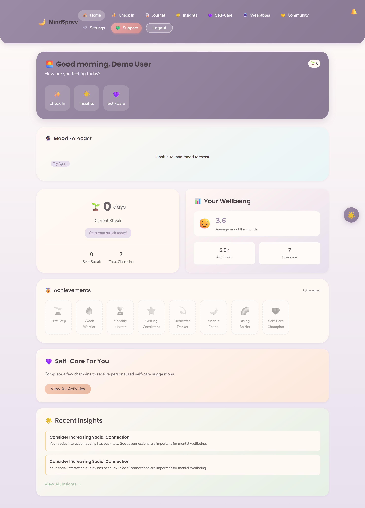
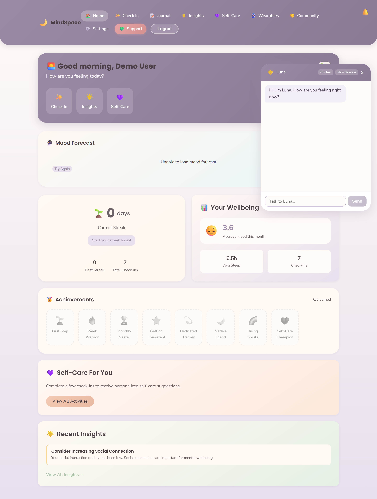
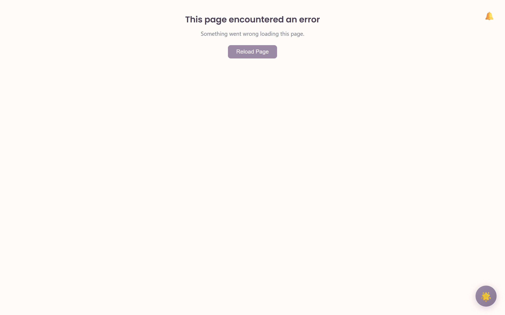

# Mindspace — Privacy-First Mental Health Tracker

**A full-stack, privacy-first mental-health platform combining mood tracking, AI-driven insights, a therapeutic chatbot, predictive analytics, and clinical-grade assessment — designed for students, professionals, parents and elderly users.**

Version 2.0.0 · MIT licensed · UK GDPR & Data Protection Act 2018 compliant · WCAG 2.1 AA accessible

---

## Screenshots

> _Add screenshots of the running application here. Suggested captures:_
> - `docs/screenshots/dashboard.png` — fleet/mood overview dashboard
> - `docs/screenshots/mood-entry.png` — multi-dimensional mood entry
> - `docs/screenshots/luna-chatbot.png` — Luna therapeutic chatbot conversation
> - `docs/screenshots/insights.png` — AI-generated insights and trends
> - `docs/screenshots/crisis-resources.png` — crisis-resource integration

```



```

---

## Overview

Mindspace is a production-grade mental-health monitoring platform built around a privacy-first architecture. It moves beyond episodic mood logging toward continuous, personalised wellbeing support: multi-dimensional tracking, machine-learning-driven trend prediction, an adaptive therapeutic chatbot, real-time risk detection with crisis-resource integration, and clinician-facing reporting.

The system serves four primary user groups — students, professionals, parents and elderly users — with accessibility and data privacy treated as first-class design constraints rather than afterthoughts.

---

## Features

### Core tracking
- **Multi-dimensional mood & wellbeing logging** — mood, energy, stress, anxiety, sleep quality, sleep hours, social-interaction quality, activities and triggers
- **Encrypted private notes** — sensitive notes protected with authenticated encryption
- **Historical analysis** — date-range filtering, trend visualisation, statistical summaries

### Intelligence layer
- **AI-driven insights engine** — automatic trend detection, pattern recognition, anomaly flagging, weekly/monthly summaries
- **Predictive analytics** — mood-trend prediction and early-warning detection
- **Adaptive recommendations** — personalised self-care activities that adjust to user feedback
- **User segmentation & personalisation** — tailoring by life-stage group

### Luna 2.0 — therapeutic chatbot
- Conversational support grounded in **CBT and ACT therapeutic techniques**
- **Crisis detection** with keyword screening and escalation to crisis resources
- **Emotional-granularity training** — helps users refine broad emotions into specific ones
- Longitudinal conversation memory and data-informed responses

### Clinical & advanced features
- **Clinical assessment** instruments and **clinician-facing reports**
- **Voice analysis** — voice-signature and emotional-tone analysis
- **Wearable integration** — biometric correlation with mood data (pluggable provider model)
- **Ecological Momentary Assessment (EMA)** and **quick check-ins**
- **Micro-interventions** and structured **therapeutic protocols**
- **Anonymous peer support** with automated moderation
- **Gamification** — engagement and habit-building mechanics

### Safety & crisis support
- **Real-time risk detection** with severity tiers (low / moderate / high / critical)
- **UK-specific crisis resources** integrated and always accessible (see below)

### Privacy, security & accessibility
- **AES-256-GCM authenticated encryption** for sensitive data (per-record unique IV + auth-tag tamper detection)
- **bcrypt password hashing**, **JWT authentication**, **Helmet security headers** (CSP + HSTS), **rate limiting**, **input validation/sanitisation**, **parameterised queries**
- **UK GDPR & Data Protection Act 2018 compliance** — data export, account deletion (right to be forgotten), audit logging, data-retention controls
- **WCAG 2.1 Level AA** — keyboard navigation, screen-reader support, adjustable font sizes, high-contrast mode, reduced-motion support, semantic HTML, ARIA labelling

---

## Technology stack

### Backend
- **Runtime:** Node.js, Express 4
- **Database:** PostgreSQL (via `pg`)
- **Authentication:** JWT (`jsonwebtoken`) + bcryptjs
- **Encryption:** Node native `crypto` — **AES-256-GCM** (authenticated encryption)
- **Real-time:** Socket.io (notifications, live updates)
- **Security:** Helmet, CORS, express-rate-limit, express-validator
- **Logging:** Winston

### Frontend
- **Framework:** React 18
- **Build tool:** Vite 5
- **Routing:** React Router 6
- **State management:** Zustand
- **HTTP:** Axios
- **Charts:** Recharts
- **Real-time:** Socket.io-client

---

## Quick start

### Option A — Docker (recommended)

The fastest, most reproducible way to run the whole stack (PostgreSQL + backend + frontend) with one command.

**Prerequisites:** Docker and Docker Compose.

```bash
# 1. Clone the repository
git clone https://github.com/mlily2024/Mindspace.git
cd Mindspace

# 2. Create a .env file at the project root with at least:
#    DB_PASSWORD, JWT_SECRET, ENCRYPTION_KEY, ADMIN_PASSWORD
#    (generate secrets with: node -e "console.log(require('crypto').randomBytes(32).toString('hex'))")
cp .env.docker.example .env   # then edit .env

# 3. Build and start everything
docker compose up --build
```

Once running:
- **Frontend:** http://localhost:3000
- **Backend API:** http://localhost:5000
- **API health check:** http://localhost:5000/health

The PostgreSQL schema is initialised automatically on first run.

To stop: `docker compose down` (add `-v` to also remove the database volume).

### Option B — Manual local setup

**Prerequisites:** Node.js 18+, PostgreSQL 14+, Git.

```bash
# 1. Clone
git clone https://github.com/mlily2024/Mindspace.git
cd Mindspace

# 2. Set up the database
createdb mental_health_tracker
psql mental_health_tracker < database/schema.sql

# 3. Configure and run the backend
cd backend
npm install
cp .env.example .env          # then edit .env with your DB password + generated secrets
npm run dev                   # starts on http://localhost:5000

# 4. Configure and run the frontend (in a second terminal)
cd frontend
npm install
echo "VITE_API_BASE_URL=http://localhost:5000/api" > .env
npm run dev                   # starts on http://localhost:3000
```

---

## Environment variables

Generate strong secrets before running:

```bash
node -e "console.log(require('crypto').randomBytes(32).toString('hex'))"
```

| Variable | Purpose |
|---|---|
| `PORT` | Backend port (default 5000) |
| `NODE_ENV` | `development` or `production` |
| `DB_HOST` / `DB_PORT` / `DB_NAME` / `DB_USER` / `DB_PASSWORD` | PostgreSQL connection |
| `JWT_SECRET` | Token signing secret (≥64 chars recommended) |
| `JWT_EXPIRE` | Token lifetime (e.g. `4h`) |
| `ENCRYPTION_KEY` | AES-256-GCM key material (≥32 chars) |
| `ADMIN_PASSWORD` | Admin panel password (≥12 chars) |
| `RATE_LIMIT_WINDOW_MS` / `RATE_LIMIT_MAX_REQUESTS` | Rate-limiting configuration |
| `ALLOWED_ORIGINS` | Comma-separated CORS allow-list |

See `backend/.env.example` for the full template.

---

## API surface

The backend exposes a RESTful API under `/api`, including:

| Area | Base route |
|---|---|
| Authentication | `/api/auth` |
| Mood tracking | `/api/mood` |
| Insights | `/api/insights` |
| Recommendations | `/api/recommendations` |
| Luna chatbot | `/api/chatbot`, `/api/luna` |
| Peer support | `/api/peer-support`, `/api/peer-support/enhanced` |
| Gamification | `/api/gamification` |
| Predictive intelligence | `/api/predictions`, `/api/predictions/v2` |
| Voice analysis | `/api/voice` |
| Interventions | `/api/interventions` |
| Wearables | `/api/wearables` |
| Quick check-in / EMA | `/api/quick-checkin`, `/api/ema` |
| Protocols | `/api/protocols` |
| Clinical assessments | `/api/assessments` |
| Clinician reports | `/api/clinician-reports` |
| Admin | `/api/admin` |

Full endpoint documentation: see `docs/API_DOCUMENTATION.md`.

---

## Project structure

```
Mindspace/
├── backend/
│   ├── src/
│   │   ├── config/        # database, logger, socket.io configuration
│   │   ├── controllers/   # request handlers
│   │   ├── middleware/    # auth, validation, error handling
│   │   ├── models/        # database models
│   │   ├── routes/        # API route definitions
│   │   ├── services/      # business logic (ML engine, Luna, insights, etc.)
│   │   ├── handlers/      # socket.io event handlers
│   │   ├── utils/         # encryption and helpers
│   │   ├── data/          # therapeutic technique data
│   │   └── server.js      # application entry point
│   ├── database/          # backend-local schema copy
│   ├── Dockerfile
│   └── .env.example
├── frontend/
│   ├── src/               # React application
│   ├── Dockerfile
│   └── nginx.conf
├── database/
│   └── schema.sql         # PostgreSQL schema (GDPR-compliant design)
├── docs/                  # API, deployment, and quick-start documentation
├── docker-compose.yml
└── README.md
```

---

## User groups & personalisation

| Group | Focus |
|---|---|
| Students | Academic stress, exam anxiety, social pressure, sleep optimisation |
| Professionals | Burnout detection, work-life balance, chronic-stress management |
| Parents | Emotional overload, caregiving stress, self-care prompts |
| Elderly | Loneliness, grief support, routine maintenance, large-text simple interface |

---

## Crisis resources (UK)

Integrated and always accessible within the app:

- **Emergency services:** 999
- **Samaritans:** 116 123
- **Shout Crisis Text Line:** text SHOUT to 85258
- **NHS Urgent Mental Health:** 111
- **Mind Infoline:** 0300 123 3393
- **PAPYRUS (under-35s):** 0800 068 4141

---

## Testing

```bash
cd backend
npm test          # Jest test suite with coverage
```

```bash
cd frontend
npm run lint      # ESLint
```

---

## Disclaimer

Mindspace is designed for wellbeing tracking and early-intervention support. It is **not** a substitute for professional mental-health care. Anyone experiencing a mental-health crisis should contact emergency services or a crisis helpline immediately.

---

## Licence

MIT — see `LICENSE`.
